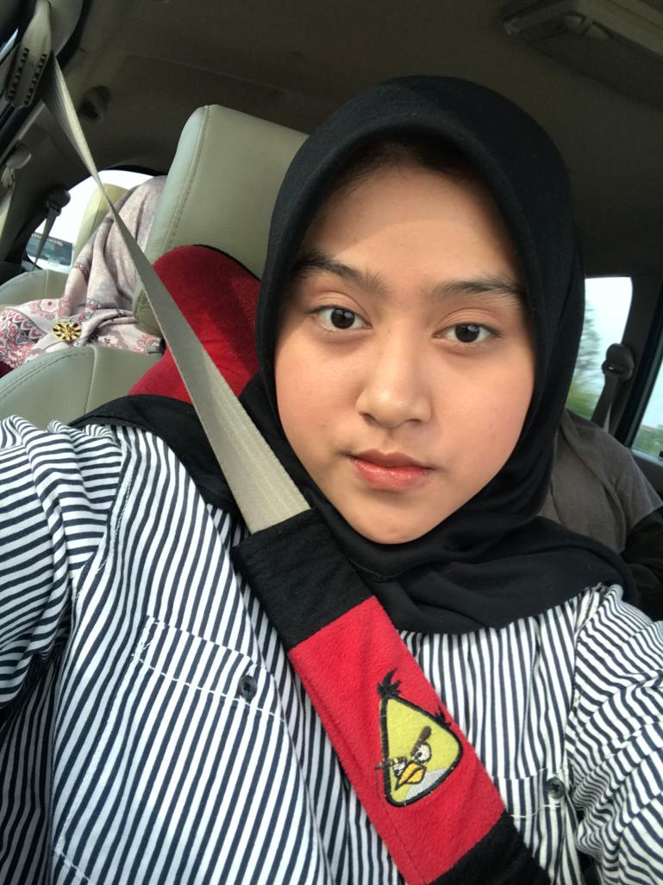

<!DOCTYPE html>
<html lang="en">
<head>
    <meta charset="UTF-8">
    <meta name="viewport" content="width=device-width, initial-scale=1.0">
    <title>Curriculum Vitae - Dinni Anisyah</title>
    
</head>
<body>
    

        <h1>Curriculum Vitae</h1>

        <!-- Photo Section -->
        

            
        

        <!-- Contact Info -->
        

            
<strong>Dinni Anisyah</strong>

            
anisyahdinni@gmail.com | (+62) 89516377337

        

        <!-- Executive Summary Section -->
        

            <h2>Executive Summary</h2>
            

                Saya adalah lulusan Sekolah Menengah Atas dengan jurusan Ilmu Pengetahuan Sosial yang cekatan, disiplin, konsisten, komunikatif, bisa memimpin, dan bertanggung jawab dalam mengurus hal-hal yang berkaitan dengan pekerjaan.
            

        

        <!-- Education Section -->
        

            <h2>Education</h2>
            <ul>
                <li>Madrasah Tsanawiyah Al Inayah Jerang Ilir (2017 – 2020)</li>
                <li>SMAN 3 Cilegon Ilmu Pengetahuan Sosial (2020 – 2023)</li>
                <li>Program Studi Ilmu Pengetahuan Sosial</li>
            </ul>
        

        <!-- Working Experiences Section -->
        

            <h2>Working Experiences</h2>
            
<strong>Butik Krisdi</strong> (2022 – 2023) - Asisten Toko

            

                Butik Krisdi adalah toko fashion yang menjual pakaian casual dan aksesoris untuk wanita muda. Butik ini terkenal dengan koleksi pakaiannya yang trendy dan harga yang terjangkau. Butik Krisdi juga menawarkan layanan personal styling untuk membantu pelanggan menemukan gaya yang tepat.
            

            <ul>
                <li>Mengelola database pelanggan</li>
                <li>Menyapa dan membantu pelanggan dengan ramah</li>
                <li>Menjawab pertanyaan pelanggan tentang produk</li>
                <li>Memberikan saran dan rekomendasi produk</li>
                <li>Membantu pelanggan memilih ukuran dan warna yang tepat</li>
                <li>Melakukan pengemasan dan pembayaran</li>
                <li>Mengatur dan menata produk di rak</li>
            </ul>
            
<strong>Ngemil Geh Yu</strong> (2022 – 2024) - Pemilik Toko

            

                Pengusaha berpengalaman di industri makanan dengan rekam jejak sukses dalam mengembangkan dan memasarkan produk makanan yang inovatif.
            

            <ul>
                <li>Membuat Jadwal Kerja</li>
                <li>Membuat Daftar Belanja</li>
                <li>Memeriksa Stok</li>
                <li>Mengelola Peralatan</li>
            </ul>
        

        <!-- Skills Section -->
        

            <h2>Skills</h2>
            <ul>
                <li>Mendengarkan Musik</li>
                <li>Memasak</li>
                <li>Menonton Film</li>
            </ul>
        

    

</body>
</html>
